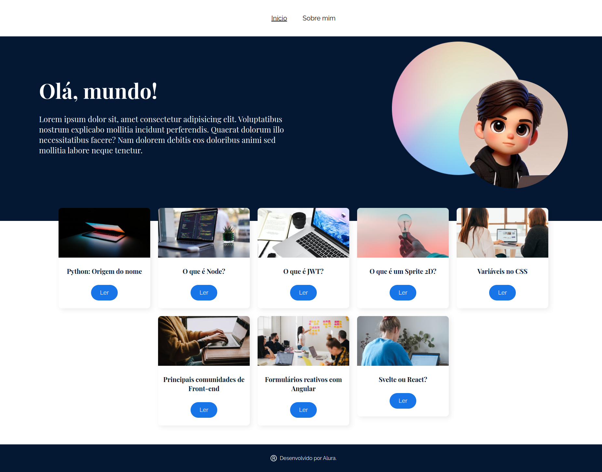
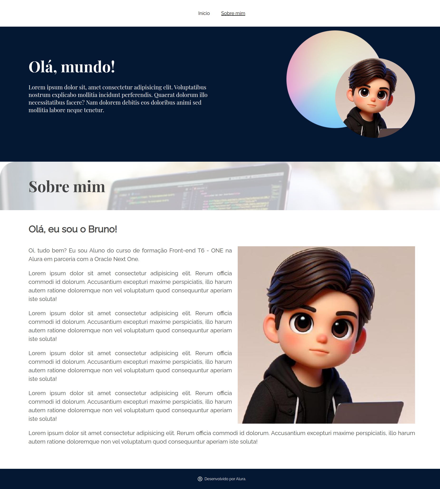
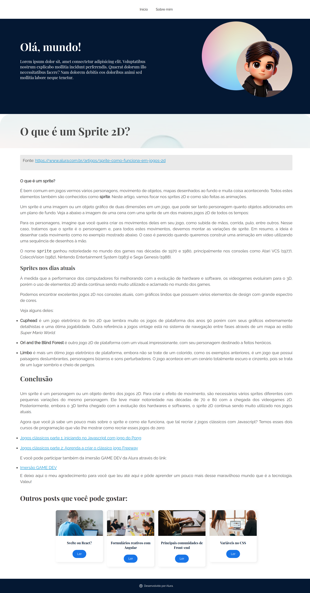

# OlaMundo - Projeto de Rotas com React Router

Este projeto foi desenvolvido utilizando a biblioteca react, vite e react-router-dom, explorando seus principais recursos, como rotas aninhadas e dinâmicas, além de hooks como useLocation e useParams

Este projeto foi desenvolvido utilizando a biblioteca react-router-dom, explorando seus principais recursos, como rotas aninhadas e dinâmicas, além de hooks como useLocation, useParams, useNavigate, Outlet, e componentes como Link. O projeto também faz uso de funções JavaScript como map, find, sort, filter, e slice.

## :dizzy: Tecnologias utilizadas

<div>
  
  
  
</div>

## :hammer: Funcionalidades

- Rotas Aninhadas e Dinâmicas: Implementação de rotas complexas utilizando componentes `BrowserRouter`, `Routes`, `Route`, e `Outlet`.
- Navegação e Links: Utilização de `Link` e `useNavigate` para facilitar a navegação.
- Manipulação de Dados: Uso das funções `map`, `find`, `sort`, `filter`, e `slice` para manipulação de dados.
- ScrollToTop: Implementação de um componente que rola a página para o topo ao clicar em um dos cards de recomendações.
- Identificação de Páginas Atuais: Estilo visual para identificar a página atual, utilizando `useLocation`.

## :camera_flash: Capturas de Tela

### Página Inicial



### Página Sobre mim



### Página de Post



## :globe_with_meridians: Acesso ao Deploy do projeto

### Vercel

O projeto está disponível na Vercel. Você pode acessá-lo através do seguinte link: 

[OlaMundo na Vercel.](https://ola-mundo-three-pi.vercel.app)


## :bricks: Estrutura do Projeto

```bash
├── public
├── src
│   ├── assets
│   ├── components
│   │   ├── Banner
│   │   ├── Button
│   │   ├── DefaultPage
│   │   ├── Footer
│   │   ├── Menu
│   │   ├── MenuLink
│   │   ├── ModelPost
│   │   ├── PostCard
│   │   └── ScrollToTop
│   ├── json
│   ├── pages
│   │   ├── About
│   │   ├── Home
│   │   ├── NotFound
│   │   └── Post
│   ├── global.css
│   ├── main.jsx
│   └── routes.jsx
├── .gitignore
├── index.html
├── jsconfig.json
├── package-lock.json
├── package.json
├── README.md
└── vite.config.js
```

## :warning: Instalação

### :dvd: Passo a Passo

1. Clone o repositório:

   ```bash
   git clone https://github.com/charlesbrcosta/OlaMundo.git
   cd OlaMundo

2. Instale as dependências:
    ```bash
    npm install ou npm i

3. Inicie o servidor de desenvolvimento:
    ```bash
    npm run dev

## :gear: Configurações

### jsconfig.json

Configuração para facilitar a importação de componentes, assets e json:

```json
{
    "compilerOptions": {
      "baseUrl": "src",
      "paths": {
        "@components/*": ["components/*"],
        "@assets/*": ["assets/*"],
        "@json/*": ["json/*"],
      }
    },
    "include": ["src"]
  }  
```

### vite.config.js

Configuração para resolver os caminhos personalizados:

```js
import { defineConfig } from 'vite';
import react from '@vitejs/plugin-react';
import path from 'path';

export default defineConfig({
  plugins: [react()],
  resolve: {
    alias: {
      '@components': path.resolve(__dirname, 'src/components'),
      '@assets': path.resolve(__dirname, 'src/assets'),
      '@json':path.resolve(__dirname, 'src/json'),
    }
  }
});
```

## :abacus: Arquitetura de Rotas

O arquivo App.jsx foi alterado para routes.jsx para melhor organização e responsabilidade das rotas da aplicação.

### routes.jsx

```js
import { BrowserRouter, Routes, Route } from 'react-router-dom';

import { Home } from './Pages/Home';
import { About } from './Pages/About';
import { Menu }  from '@components/Menu';
import { Footer } from '@components/Footer';
import { DefaultPage } from '@components/DefaultPage';
import { Post } from '../src/Pages/Post'
import { NotFound } from './Pages/NotFound';
import ScrollToTop from '@components/ScrollToTop';

export function AppRoutes() {

  return (
    <>
      <BrowserRouter>
        <ScrollToTop />
        <Menu />
        <Routes>
          <Route path='/' element={<DefaultPage />}>
            <Route index element={<Home />} />
            <Route path='about' element={<About />} />
          </Route>
          <Route path='posts/:id/*' element={<Post />}/>
          <Route path='*' element={<NotFound />} />
        </Routes>
        <Footer />
      </BrowserRouter>
    </>
  )
}
```

## :hook: Hooks e Componentes Principais

### Link e useLocation

Utilizado para acessar a localização atual da URL da aplicação

```js
import { Link, useLocation } from 'react-router-dom';
import styles from './MenuLink.module.css';

export function MenuLink({ children, to }) {

    const location = useLocation();

    return (
        <Link
            className={`
                ${styles.link}
                ${location.pathname === to ? styles.highlightedLink : ''}   
            `} to={to}>
            {children}
        </Link>
    );
}
```

### Estilização

Estilo `highlightedLink` adicionado no CSS para sublinhar o link da página atual, utilizando useLocation para identificar a página:

```css
.highlightedLink {
    text-decoration: underline;
}
```

### useNavigate

Utilizado para voltar à página anterior, quando a página não for encontrada:

```js
import { Button } from '@components/Button';
import styles from './NotFound.module.css';

import dogImage from '@assets/erro_404.png';
import { useNavigate } from 'react-router-dom';

export function NotFound() {

    const navigate = useNavigate();
    const go_back = -1;

    return(
        <>
            <div className={styles.containerContent}>
                <span className={styles.text404}>404</span>
                <h1 className={styles.title}>Ops! Página não encontrada.</h1>
                <p className={styles.paragraph}>
                    Tem certeza de que era isso que você estava procurando?
                </p>
                <p className={styles.paragraph}>
                    Aguarde uns instantes e recarregue a página, ou volte para a página inicial.
                </p>

                <div 
                    className={styles.containerButton}
                    onClick={() => navigate(go_back)}
                >
                    <Button size='lg'>
                        Voltar
                    </Button>
                </div>

                
            </div>

            <div className={styles.blankSpace}></div>
        </>
    );
}
```

### ScrollToTop

Componente para rolar a página para o topo quando clicar nos cards recomendados:

```js
import { useEffect } from "react";
import { useLocation } from "react-router-dom";

export default function ScrollToTop() {
    const { pathname } = useLocation();

    useEffect(() => {
        window.scrollTo(0, 0);
    }, [pathname]);

    return null;
}
```

### Manipulação de Dados

Os dados dos cards são armazenados no arquivo posts.json e manipulados com funções JavaScript como `map`, `find`, `sort`, `filter` e `slice` 

Foi utilizado o hook `useParams` para acessar os parâmetros da URL.

- O `hook` useParams é usado para acessar o valor de id na URL.
- O `id` é então usado para encontrar a postagem correta no arquivo posts.json.
- Se a postagem for encontrada, seus detalhes são renderizados; caso contrário, a página de "Not Found" é exibida.

Exemplo do uso de `map`, `find`, `sort`, `filter`, `slice` e `useParams`

```js
import { useParams } from "react-router-dom";
import ReactMarkdown from "react-markdown";

import { NotFound } from "../NotFound";
import { ModelPost } from "@components/ModelPost";
import { DefaultPage } from "@components/DefaultPage";
import { PostCard } from "@components/PostCard";

import posts from '@json/posts.json';

import './Post.css';
import styles from './Post.module.css';

export function Post() {

    const parameters = useParams();

    const post = posts.find((post) => {
        return post.id === Number(parameters.id)
    });

    if (!post) {
        return <NotFound />
    }

    const recommendedPosts = posts
        .filter(post => post.id !== Number(parameters.id))
        .sort((a, b) => b.id - a.id)
        .slice(0, 4);

    return (
        <DefaultPage>
            <ModelPost
                coverPhoto={`/posts/${post.id}/capa.png`}
                title={post.title}
            >
                <div className="post-markdown-container">
                    <ReactMarkdown>
                        {post.text}
                    </ReactMarkdown>
                </div>
                <h2 className={styles.titleOtherPosts}>
                    Outros posts que você pode gostar:
                </h2>
                <ul className={styles.recommendedPosts}>
                    {recommendedPosts.map((post) => (
                        <li key={post.id}>
                            <PostCard post={post}/>
                        </li>
                    ))}
                </ul>
            </ModelPost>
        </DefaultPage>
    );
}
```

## :handshake: Contribuição

Se você quiser contribuir com o projeto, siga os passos abaixo:

    Faça um fork deste repositório.
    Crie uma nova branch (git checkout -b feature/nova-feature).
    Faça commit das suas alterações (git commit -am 'Adiciona nova feature').
    Faça push para a branch (git push origin feature/nova-feature).
    Abra um Pull Request.

## :student: Autor

[<br><sub>Charles Bruno</sub>](https://github.com/charlesbrcosta)


## :page_facing_up: Licença

Este projeto está licenciado sob a [Licença MIT](https://www.mit.edu/~amini/LICENSE.md).
